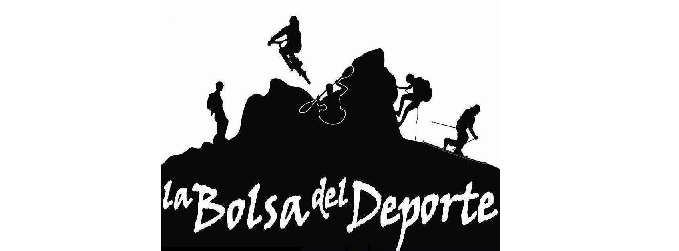

# E-commerce de tienda de Montaña


Descripción general: Tienda online creada como trabajo final de mi curso de ReactJs, similar a otra que hice para el curso de Js, y está ideada pensando de una tienda local que vende articulos deportivos de montaña.

Este proyecto fué creado con [Create React App](https://github.com/facebook/create-react-app).

## Librerías utilizadas:

- [Firebase](https://firebase.google.com/)
Se creó una base de datos con firebase y se cargan los datos de los productos desde esta, pudiendo cargarse ordenes de compra desde la app.
- [React-router-dom](https://reactrouter.com/en/v6.3.0/getting-started/installation)
Para generar la navegación dentro de la pagina en sus distintas secciones.
- [React-toastify](https://fkhadra.github.io/)
Librería para generar mensajes de alerta.

### Funcionalidades del proyecto

- El usuario puede navegar por tres secciones distintas a las que se dedica la tienda, viendo los productos pertencientes a cada seccion, o bien ver todos los productos.
- Se puede ingresar a ver detalles de cada producto, con imagenes, precio y estado.
- Desde el detalle se puede agregar el producto elejido a un carrito, seleccionando la cantidad deseada y con limite según stock.
- Se puede navegar por la pagina y seguir agregando otros productos o cambiar la cantidad de los ya seleccionados.
- Se puede ver la compra elejida en el carrito con las cantidades, precios subtotales y total de la compra.
- Se puede generar una orden de compra que se carga en Firebase a través del formulario cargando la información del comprador.

### Pasos para correr el proyecto local
1. Clonar el repositorio desde github
```
git clone https://github.com/miguelcastiarena/PreEntrega2-Castiarena.git
```
2. Abrirlo en algun editor de codigo (Visual Studio Code u otro) e instalar las dependencias.
```
npm install
```
3. Correr el proyecto de manera local
```
npm start
```
